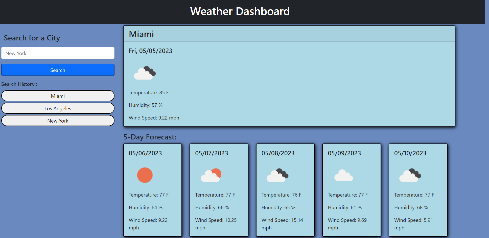

# Weather App

## Description

It is a simple Weather app. When the city is searched, the current weather is displayed, and the forecast for the next 5 days. After looking up a city, the city is saved in the search History section of the page, so you can get an easy access to the weather data again.

## Installation

N/A

## Usage

Link to the app : https://oliver23n.github.io/weather-app/

    

## Credits

All code written and developed by Oliver Nasevski
https://github.com/oliver23n

## License

Refer to Repo